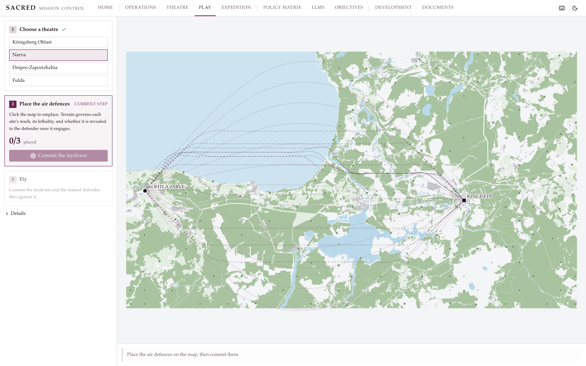

# SACRED

SACRED is a Soft Actor-Critic, Robust Evolutionary Deep reinforcement learning framework that
generates resilient, unpredictable routing policies for contested logistics operations. It was
developed and evaluated in an MSc thesis at Imperial College London (Kilian Schwarz, 2026), and
this repository is the thesis's code and experimental record.


*Four consecutive serials in the Königsberg Oblast theatre. SACRED effectively anticipates where
the adversary is likely to emplace air defences.*

Resupply operations in contested environments confront a class of threat that conventional
logistics planning was never designed to address. When convoys travel repeatedly between bases
and the forward positions they resupply, they generate a Pattern of Life: an observable record
of routes, behaviours, and habits. A capable adversary intent on maximising the chance of
interception studies that record and commits its interdiction assets to the network in advance
of the next sortie. By the time the threat is observed the engagement has already occurred, so
the only viable defences are anticipation and unpredictability. A planner that reliably selects
the shortest route is intercepted with certainty in the worst case, precisely because its
behaviour can be predicted without error.

Adversarial Reinforcement Learning promises routing policies hardened by training against a
hostile opponent, yet the literature offers no systematic account of when that promise holds.
Instead of asking whether adversarial training works in a narrow domain, this project provides
a map, identifying the settings in which the approach demonstrably fails and is unnecessary and
those where adversarially-trained policies deliver unparalleled value.

## Principal findings

The central finding is that SACRED's calibrated unpredictability transfers zero-shot. Trained
adversarially on three cities, it beats every fixed strategy of a fourth at 0.639 ± 0.025 of
the static cap. Far from a trivial benchmark, this reference also bounds the optimal Nash
mixture an exact solver would produce. Thus, SACRED outperforms, in a single zero-shot attempt,
the absolute best static plan available. When an identical network was deprived of its memory,
its score dropped to a severely degraded 1.43, confirming that the ability to adapt to recent
history drives the entire performance gain.


Learned policies are advantageous where computation fails. Against a Pattern-of-Life adversary,
SACRED ties the best heuristics at an interdiction budget of K=2 and beats every heuristic
across the remaining computable region, K=3 to K=6, with margins widening from 8.6 to 20.7%.
The best heuristics sit at around 1.55 times the exact optimum, translating to wide gaps that
are only filled by using SACRED. Once Nash equilibria become incomputable, learning provides
the only alternative for realising additional performance gains.


SACRED is not a panacean or universally efficacious policy, and the negative results garnered
throughout the thesis are reported transparently, serving to demarcate the exact problem
configurations where SACRED is highly performant. Adversarial training against congestion did
not condition successful policies, because congestion is observable and easily avoidable,
allowing reactive defenders to dominate. In interdiction games at low K budgets, randomisation
over edge-disjoint routes is often optimal or quasi-optimal and SACRED therefore unnecessary.


SACRED is highly generalisable, requiring only a route menu, a risk estimate per route, and its
own recent history. This means that the core mechanism was simply transferable to air-based
resupply missions. On the Königsberg to Gvardeysk map, it beat the static reference on all
eighteen cells, at 0.351 of this reference and 1.46 times the exact optimum in a zero-shot
attempt.

LLMs can be used to augment SACRED, resulting in measurable performance increases. While
Llama-3.3-70B and Qwen3.6-27B both fail as decision-making defenders, they can perfectly
categorise descriptions of enemy activity, which SACRED was ultimately unable to achieve alone.
LLMs reliably identify the right adversary even when contradictory information is presented, or
where keyword matching collapses. They are also highly effective training curriculum authors.


Where the adversary simply plays a static Nash equilibrium, simple randomised rules are
provably optimal. However, if the adversary observes and adapts, SACRED achieves evasion rates
that no solver or heuristic can match, and does so on completely unseen networks, on the ground
and in the air.

## Mission Control

The Mission Control application is the interactive deliverable. The theatres, the trained
policies, and the experimental record are explorable through it.




Repository: [sacred-mission-control](https://github.com/Kilian-S/sacred-mission-control)

## Layout

Two self-contained arms.

- `roads/`, the road-based interdiction games (thesis Acts 1 to 3 and the road half of Act 5).
  `src/` holds the environments, agents and oracles, `scripts/` the trainers and evaluators,
  `analysis/` the exact solvers, probes and scoring tools, `tests/` the suite (171 tests),
  `experiments/` the experiment records, `data/maps/` the extracted city graphs.
- `aerial/`, the aerial theatre games (thesis Acts 4 and 5) in the same layout, with 246 tests
  and the theatre geometry under `data/maps/`.

## Experiment records

One record per experiment in `experiments/`, stating the question, the pinned game
configuration, the pre-registered decision criteria, the baseline family and the results.
All numbers cited in the thesis trace to these records.

| Thesis Act | Records |
|---|---|
| Act 1: Congestion | `roads/experiments/gen03_robustness_dynassign.md` to `gen07_contested_matrix.md` |
| Act 2: Incomputability at Scale | `roads/experiments/gen43_unified_kboundary.md` |
| Act 3: Zero-Shot Transfer | `roads/experiments/gen27_dynamic_generalist.md`, with controls in `gen16_multicity.md`, `gen21_vanilla_transfer.md`, `gen22_rotation.md`, `gen25_dr_control.md`, `zst_map_robustness.md` |
| Act 4: From Road-Based to Air-Based Resupply | `aerial/experiments/gen31_aerial_dyn.md`, `gen45_unified_corridor.md` |
| Act 5: LLM-Assisted SACRED | `roads/experiments/b2_llm_benchmark.md`, `gen34_hidden_adversary.md`, `gen38_llm_enemy_id.md`; `aerial/experiments/gen39_concealment.md`, `gen43_exam.md`, `gen44_budget_sweep.md` |
| Synthesis and References | `roads/experiments/regime_decision_table.md`, `ref_artificialanalysis_llm_index.md`; `aerial/experiments/theatre_atlas.md` |

## Reproduction

Each arm runs independently on Python 3.13 with its `requirements.txt`. From inside an arm
directory,

```
pip install -r requirements.txt
PYTHONPATH=. python -m pytest tests/
```

Training and evaluation commands are pinned in the experiment records. Run outputs land under
`models/runs/`, not shipped; the records name the artefact paths a rerun regenerates. Every
result was trained on a single laptop-class CPU. The language-model experiments call locally
served open-weight models (Llama-3.3-70B, Qwen3.6-27B, and the Qwen3.5 family) through an
OpenAI-compatible endpoint and log every request and reply.

## Data

Road graphs and theatre geometry derive from OpenStreetMap data, © OpenStreetMap contributors,
available under the Open Database Licence (ODbL). The maps carry network geometry only.
